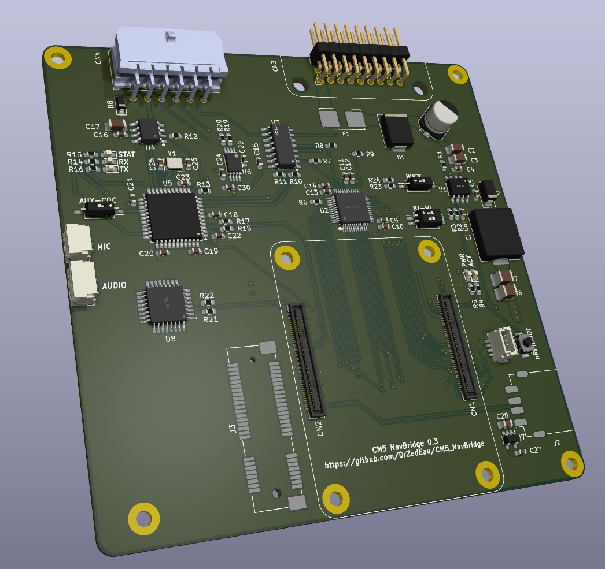

# CM5 NavBridge 0.3

A Raspberry Pi Compute Module 5 Carrier board for E-Series BMW (E46, E39, E85 etc...) with Nav module and CID or BMBT (Headunit/Radio with 6.5 inches OEM display). 

This board is installed between the car harness and the Nav module (Mk3 or Mk4). It keeps the OEM Headunit/Radio system while adding video from the RPI to the OEM display. An audio (Stereo) output is present that can be connected to the AUX input of the OEM Headunit/Radio or to the CDC harness (The MCU would simulate the CDC module). 
It also provides a microphone input, either from the OEM or aftermarket microphone.

This board is meant to be used with this project https://github.com/f-io/LIVI to add Carplay and Android Auto capabilities to the RPI. 
For futur releases, I'm planning on providing a dedicted OS (based on AGL maybe?) to use the RPI as a standalone system for modern features (Music streaming, phone calls, navigation etc...). 

  

## Features
- Automotive grade buck converter (LMR14030-Q1) for a 5V and 3.5A output.
- USB 2.0 for flashing the RPI. It can also be used as a regular USB port when system is up.
- Video output from the DPI to a 24 bits video DAC (ADV7125)
- Integrated audio chip PCM2912A (Stereo output and mono input)
- Reads BMW IBUS with the integrated LIN transicver (ATA663254) connected to the MCU (ATmega32U4) for managing power for the RPI, keyboard simulation from OEM Headunit/Radio buttons and CDC emulation.
- Mini PCIe port to add features (GPS or DAB+ boards)
- No modifications required to the OEM system
  

## Repository contents
- `hardware` Kicad project
- `software` RPI scripts and MCU code
- `3D` STLs files for 3D printing

## TODO
- Finish PCB design V0.3
- Order board
- Test the board on various E-Series BMWs

## Contributing
- Any improvements on the design are welcome.

## References
- https://www.e46fanatics.com/threads/bmw-on-board-monitor-without-navigation-unit.1303552
- https://github.com/f-io/LIVI
- https://bmwteka.com/wds/en/e85/e82460cf
- https://bmwteka.com/wds/en/e85/1b7f9876
- https://forums.atariage.com/topic/260654-new-3do-rgb-mod-possibility/