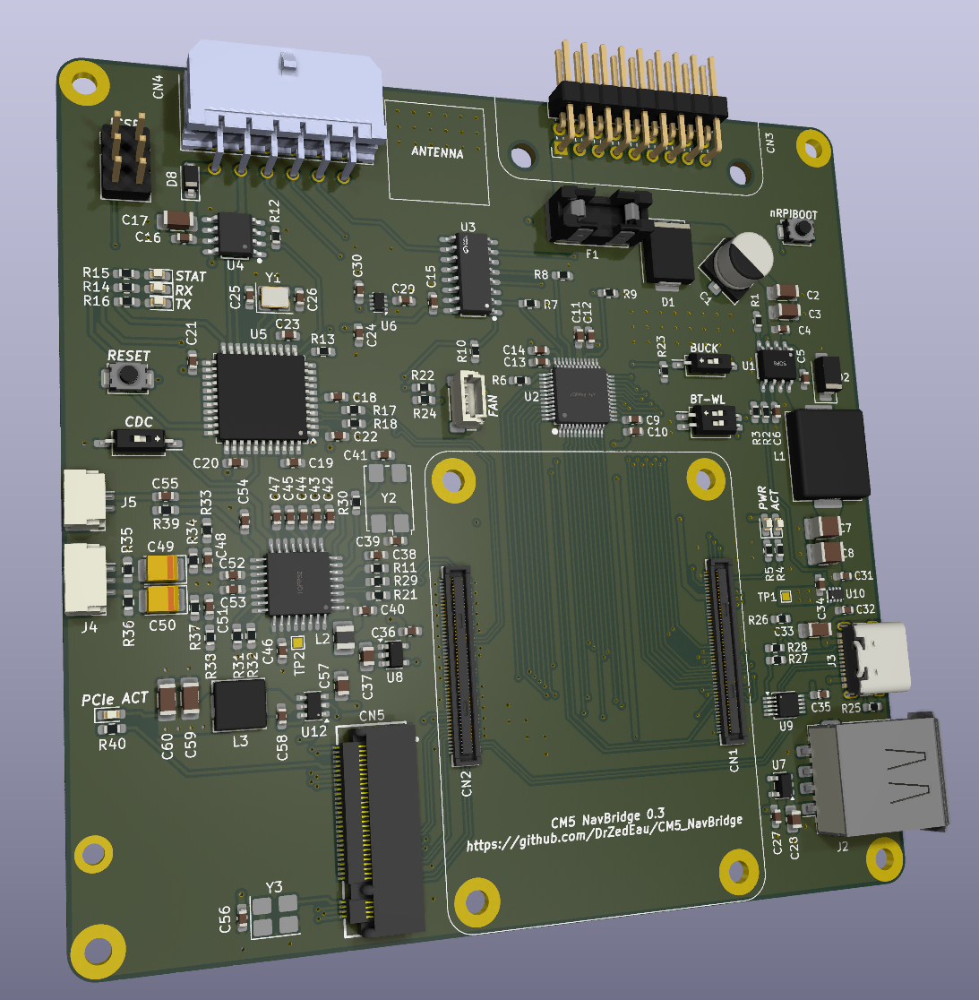

# CM5 NavBridge

A Raspberry Pi Compute Module 5 Carrier board for E-Series BMW (E46, E39, E85 etc...) with Nav module and CID or BMBT (Headunit/Radio with 6.5 inches OEM display).<br>

This board is installed between the car harness and the Nav module (Mk3 or Mk4). It keeps the OEM Headunit/Radio system while adding video from the RPI to the OEM display. An audio (Stereo) output is present that can be connected to the AUX input of the OEM Headunit/Radio or to the CDC harness (CDC Emulation not working at the moment).<br>
It also provides a microphone input, either from the OEM or aftermarket microphone.

This board is meant to be used with this project https://github.com/f-io/LIVI to add Carplay and Android Auto capabilities to the RPI.<br>
For futur releases, I'm planning on providing a dedicted OS (based on AGL maybe?) to use the RPI as a standalone system for modern features (Music streaming, phone calls, navigation etc...).<br>

<p align="center">
  
</p>


## Features
- Automotive grade buck converter (LMR14030-Q1) for a 5V and 3.5A output.
- USB-C 2.0 for flashing the RPI shared with the USB Type A connector with an automatic selection. 
- Video output from the DPI to a 24 bits video DAC (ADV7125)
- Reads BMW IBUS with the integrated LIN transicver (ATA663254) connected to the MCU (ATmega32U4) for managing power for the RPI, keyboard simulation from OEM Headunit/Radio buttons and CDC emulation.
- No modifications required to the OEM system.
- Integrated audio chip PCM2912A (Stereo output and mono input).
- M.2 PCIe M Key Slot to add features (Custom GPS or DAB+ 2230 boards).


## Repository contents
- `hardware` Kicad project
- `software` RPI scripts and MCU code/firmware
- `3D` STLs files for 3D printing


## BOM
| Part                              | Description |
| -----------                       | ----------- |
| The assembled NavBridge PCB       |  |
| 3D printed connector              |  | 
| 3D printed case                   |  |
| DIY Cable for the NavBridge       | Cable used from the NavBridge to the OEM Nav module | 
| DIY Cable for audio output        | Cable wired to the AUX input or CDC for audio output |
| DIY Cable for audio input         | Cable for electret microphone input (OEM or aftermaket) |
| A Raspberry Pi Compute Module 5   | The RPI CM5 lite version is not compatible with the PCB, a CM5 with eMMC is mandatory and preferably with at least 4GB of RAM | 
| CM5 Heatsink                      | Hightly recommended as the CM5 might throttle without heat dissipation   |
| A USB dongle for AA/Carplay       | Either a Carlinkit CPC200-CCPA or CPC200-CCPW (Newer version of LIVI do not require a dongle for Android phones) | 


## Documentation
[PREPARE AND FLASH THE NAVBRIDGE](documentation/PREPARATION.md)<br>
[INSTALL THE NAVBRIDGE IN CAR](documentation/INSTALLATION.md)<br>


## TODO
- Test the board on various E-Series BMWs and Nav modules (Has only been tested on a BMW Z4 E86 with MK4 Nav Module)
- Improve the PCB design with available ICs (v0.4)
- CDC Emulation


## Contributing
- Any improvements on the design are welcome.


## References
- https://www.e46fanatics.com/threads/bmw-on-board-monitor-without-navigation-unit.1303552
- https://github.com/f-io/LIVI
- https://bmwteka.com/wds/en/e85/e82460cf
- https://bmwteka.com/wds/en/e85/1b7f9876
- https://forums.atariage.com/topic/260654-new-3do-rgb-mod-possibility/


# CM5 NavBridge

A Raspberry Pi Compute Module 5 carrier board designed for BMW E-Series vehicles equipped with the OEM navigation system (E46, E39, E85, and similar platforms).

The CM5 NavBridge installs inline between the factory wiring harness and the BMW MK3/MK4 navigation module, allowing a Raspberry Pi CM5 to integrate with the original infotainment system while preserving the OEM look and functionalities.

Its primary purpose is to provide modern features such as Apple CarPlay and Android Auto through the Raspberry Pi while continuing to use the factory display, controls, and audio system.

<p align="center">
  
</p>

---

## Overview

The board interfaces directly with the factory navigation module and provides:

- Video output from the Raspberry Pi to the OEM BMW display
- Stereo audio output for integration with the factory AUX input or CDC interface
- Microphone input supporting both OEM and aftermarket microphones
- Integration with the BMW I-Bus for power management and button control
- CDC emulation via the onboard microcontroller

The hardware is designed to work alongside the **LIVI** project, which provides the software environment for Apple CarPlay and Android Auto support.

Future software releases are planned to include a dedicated application, enabling the Raspberry Pi to function as a standalone infotainment platform with features such as:

- Music streaming
- Hands-free calling
- Navigation
- Media playback
- Additional connected vehicle features

---

## Features

### Hardware

- Automotive-grade 5V and 3.5A power supply using the **LMR14030-Q1**
- USB-C interface for Raspberry Pi flashing
- Automatic selection between USB-C and USB Type-A
- 24-bit video DAC (**ADV7125**) for OEM display output
- Integrated **PCM2912A** USB audio codec
  - Stereo line output
  - Mono microphone input
- M.2 PCIe M-Key (2230) expansion slot for additional modules such as GPS or DAB+

### Vehicle Integration

- Reads BMW I-Bus through an onboard **ATA663254** LIN transceiver
- **ATmega32U4** microcontroller for:
  - Raspberry Pi power management
  - OEM button translation
  - CD changer (CDC) emulation
- No modifications to the factory wiring or infotainment system are required

---

## Repository Structure

```text
hardware/      KiCad hardware design files
software/      Raspberry Pi software and MCU firmware
3D/            STL files for printed components
documentation/ Installation and project documentation
```

---

## Documentation

[0. Bill of materials](documentation/BOM.md)<br>

[1. Prepare the PCB](documentation/PCB.md)<br>

[2. Flash the NavBridge](documentation/FLASH.md)<br>

[3. Install the NavBridge](documentation/INSTALL.md)<br>

---

## Project Status

The hardware is currently functional and has been successfully tested on:

- BMW Z4 E86 with MK4 Navigation Module

Testing on additional E-Series platforms and navigation variants is ongoing.

---

## Roadmap

- Improve PCB layout for the next hardware revisions
- Expand compatibility testing across additional BMW platforms
- Develop a dedicated application

---

## Contributing

Contributions are welcome.

Bug reports, hardware improvements, firmware enhancements, and documentation updates are all appreciated. Please open an issue or submit a pull request if you would like to contribute.

---

## References

- LIVI project https://github.com/f-io/LIVI
- BMW Wiring Diagram System (WDS) https://bmwteka.com/wds/en/e85/e82460cf 
- BMW On-Board Monitor documentation https://bmwteka.com/wds/en/e85/1b7f9876
- Community resources https://www.e46fanatics.com/threads/bmw-on-board-monitor-without-navigation-unit.1303552 
