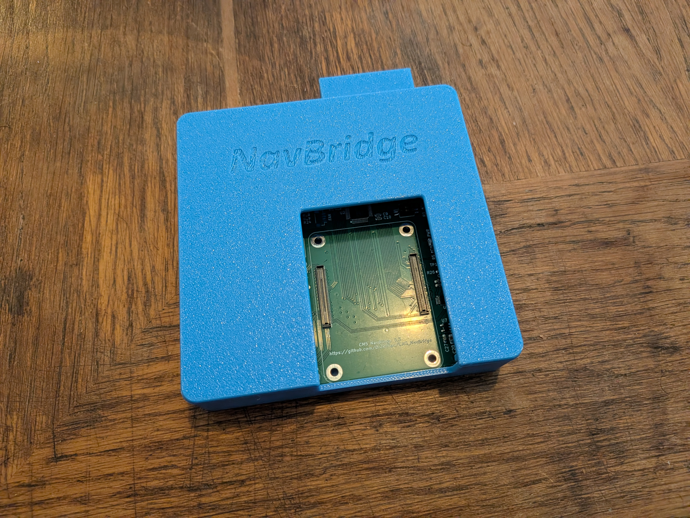
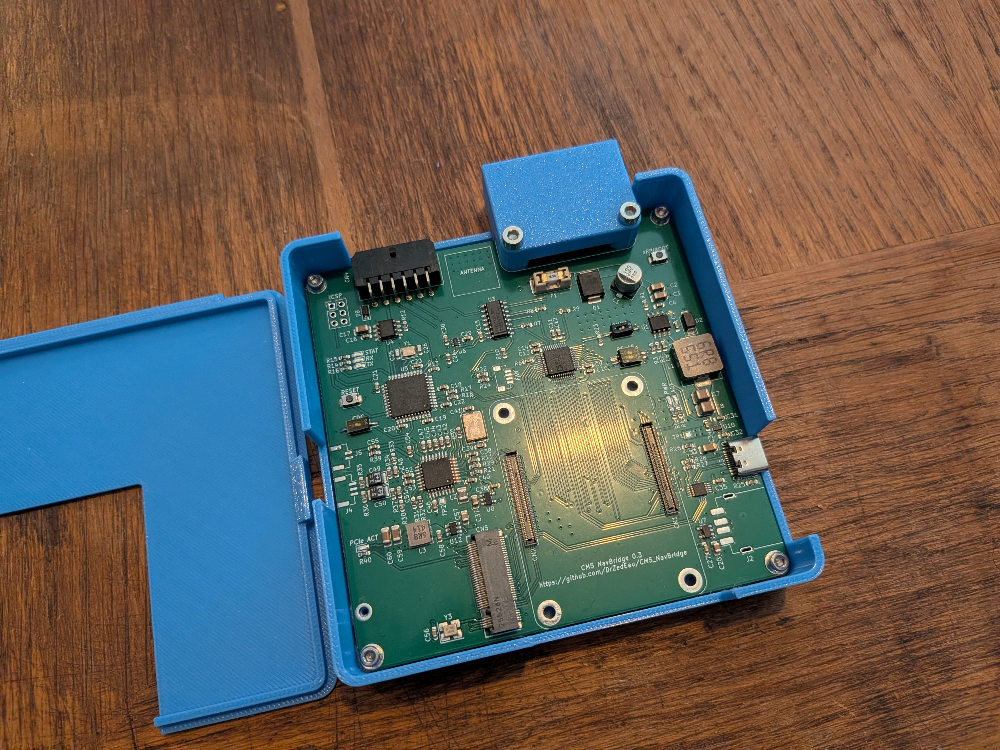
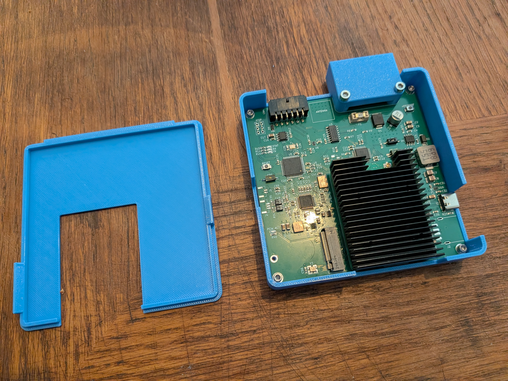
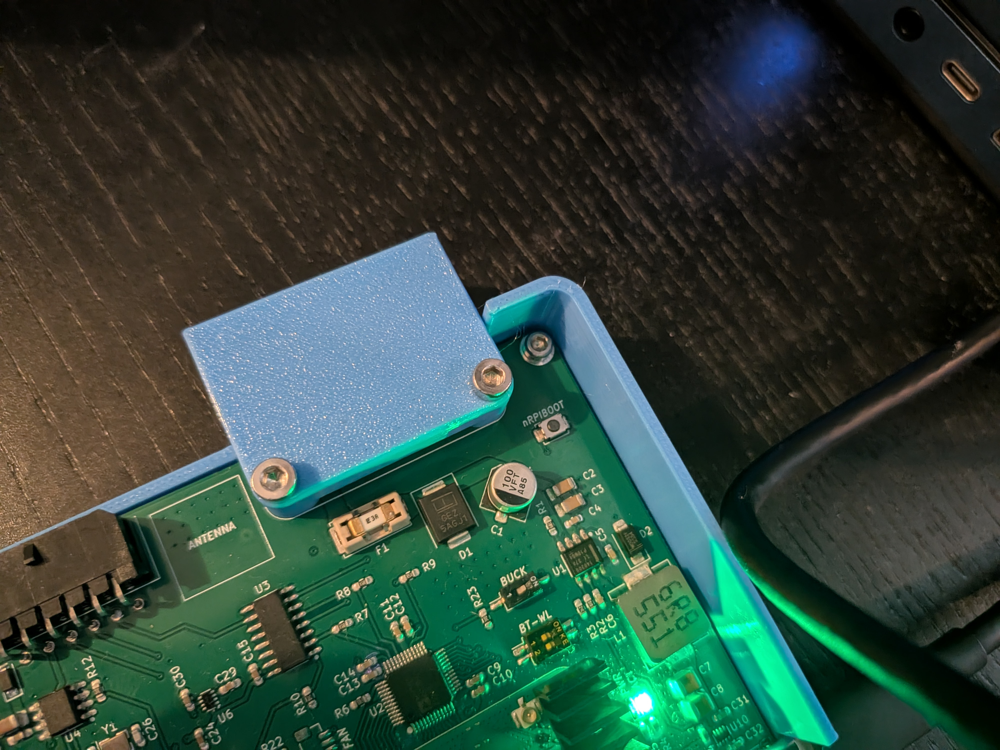
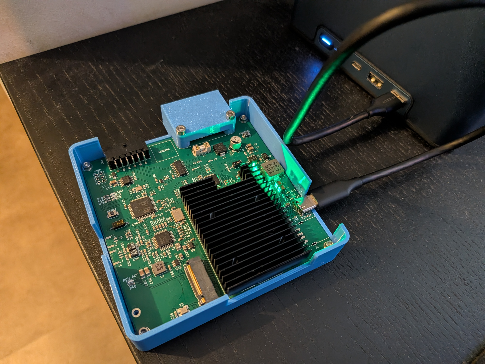
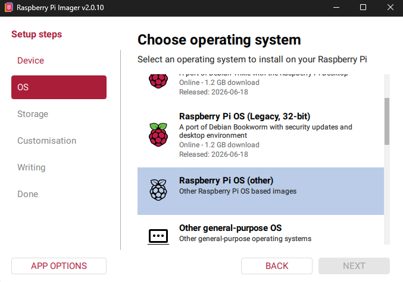
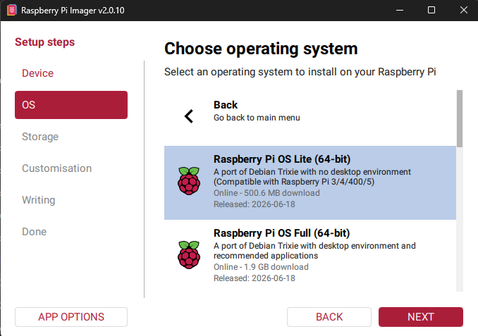
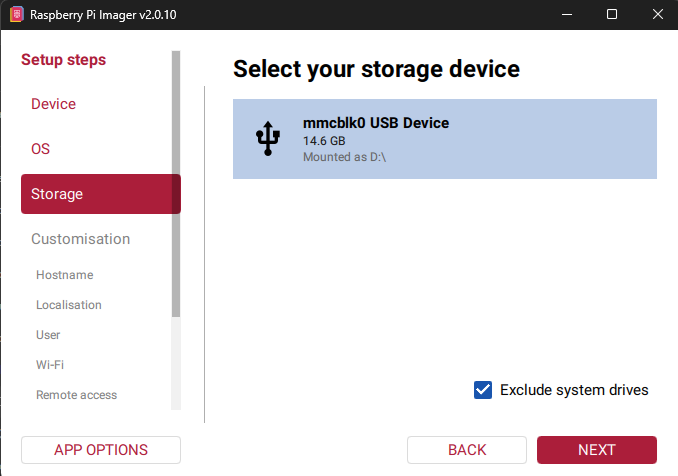
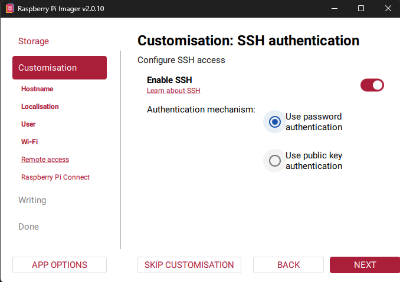

# Prepare and flash the NavBrdige

## Assemble the board with the RPI CM5

Once you have assembled the PCB with its case it should look like this:

<p align="center">
  
</p>

<p align="center">
  
</p>

Install the RPI CM5 and ensure the CM5 is correclty connected to the PCB, you can also use M2.5 screws to secure it in place with the the heatsink:

<p align="center">
  
</p>


## Flash the RPI CM5

Locate the nRPIBOOT switch and press it down while connecting the USB-C cable to a PC:

<p align="center">
  
</p>

<p align="center">
  
</p>

Once the CM5 has booted you can run the rpiboot tool on your PC so you can flash the CM5 with the Raspberry Pi imager tool.
Raspberry documentation on how to flash the Compute Module: https://www.raspberrypi.com/documentation/computers/compute-module.html#flash-compute-module-emmc

On the Raspberry Pi imager tool, select the CM5 board and your OS to install:

<p align="center">
  
</p>

<p align="center">
  
</p>

Select your storage:

<p align="center">
  
</p>

Ensure SSH is enabled for post flash configuration:

<p align="center">
  
</p>

Once the flash has completed, unplug the board and connect it to a USB-C charger that can deliver at least 5V/3A.

<p align="center">
  
</p>

## Configure OS and install requirements

The RPI CM5 should boot (first boot takes some time) and be accessible via SSH. Once connected, run the following command to configure the OS:

```curl -fsSL https://raw.githubusercontent.com/DrZedEau/CM5_NavBridge/dev/software/scripts/setup.sh | sudo bash```

This script:
- removes packages and unused services to improve the boot time
- update OS and install required packages
- setup the csync script with the integrated RP1 chip
- setup the video output for the ADV7125 DAC chip with the 400*240p resolution (matched with OEM display)
- ensure volume is set to 100% on boot (below is to low for the car)
- installs a splash screen
- flashes the MCU when in bootloader mode (RESET switch on the board sets the MCU into bootloader mode and can be flashed from the OS)

Reboot the RPI with the following command:

```sudo reboot```


## Install LIVI 

To get Android Auto and Carplay on the RPI, I'm using this project https://github.com/f-io/LIVI <br>

Install the RPI-Lite OS version:

```curl -fL -o install.sh https://raw.githubusercontent.com/f-io/LIVI/main/scripts/install/pi-lite/install.sh
chmod +x install.sh
./install.sh```

